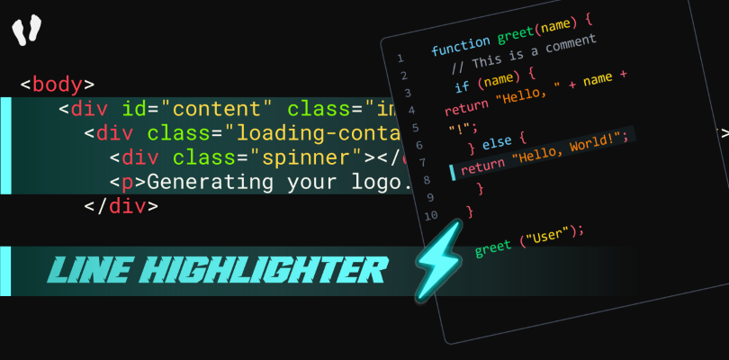
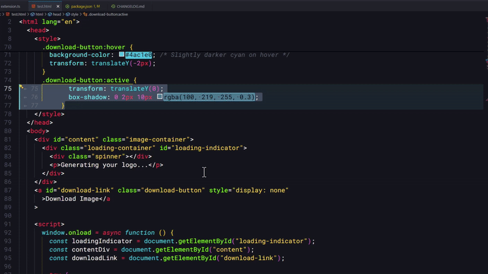
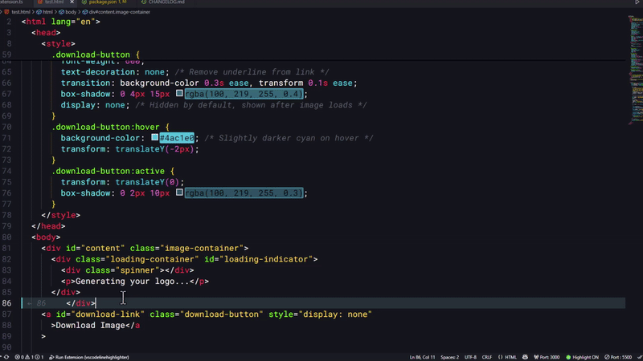

# ⚡ Line Highlighter

A sleek and minimalist VS Code extension that **automatically highlights** your **selected lines** and optionally displays their **line numbers** inline — all styled to your taste.



---

## ✨ Features

- 🔹 Highlights selected lines with customizable styles
- 🔹 Inline line number overlay (toggle on/off)
- 🔹 Customizable highlight colors, borders, and styles
- 🔹 Live updates on selection change
- 🔹 Lightweight & blazing fast
- 🔹 Toggle ON/OFF via command or status bar button



---

## 🎮 Usage

1. Select one or more lines
2. Lines will highlight instantly
3. Click the `Line Highlighter` toggle in the status bar to enable/disable
4. Or run the `Toggle Line Highlight` command from the Command Palette


---

## ⚙️ Settings

---

Customize the experience via `settings.json`:

```json
"vscode-line-highlighter.backgroundColor": "rgba(100, 219, 255, 0.07)",
"vscode-line-highlighter.borderColor": "rgba(100, 245, 255, 0.85)",
"vscode-line-highlighter.borderWidth": "0 0 0 3px",
"vscode-line-highlighter.isWholeLine": true,
"vscode-line-highlighter.toggleHighlight": "Toggle line highlighting on/off"

```

## Status Bar Button

A status bar item appears when the extension is active. It:

Shows current status ✅ / ❌

Lets you toggle highlighting instantly



## 🚀 Demo

(Tip: You can generate this using ScreenToGif or VS Code recorder)

## 🖌️ Customization Tips

Want to match your theme or make it glow?
Try tweaking backgroundColor and borderColor in the extension settings. You can even animate it with custom themes!

## 🧪 Known Limitations

- Line numbers might overlap with other inline decorations

- Not intended for block selection or multi-cursor coloring (yet 👀)

## 💬 Feedback & Contributions

Have ideas? Found a bug?
Open an issue or pull request on GitHub.

Let’s build magic, together. 🔮✨

## 🧾 License

MIT — Free for everyone. Eat. Sleep. Highlight. Repeat.

## Author

Footprint Arts @2025
